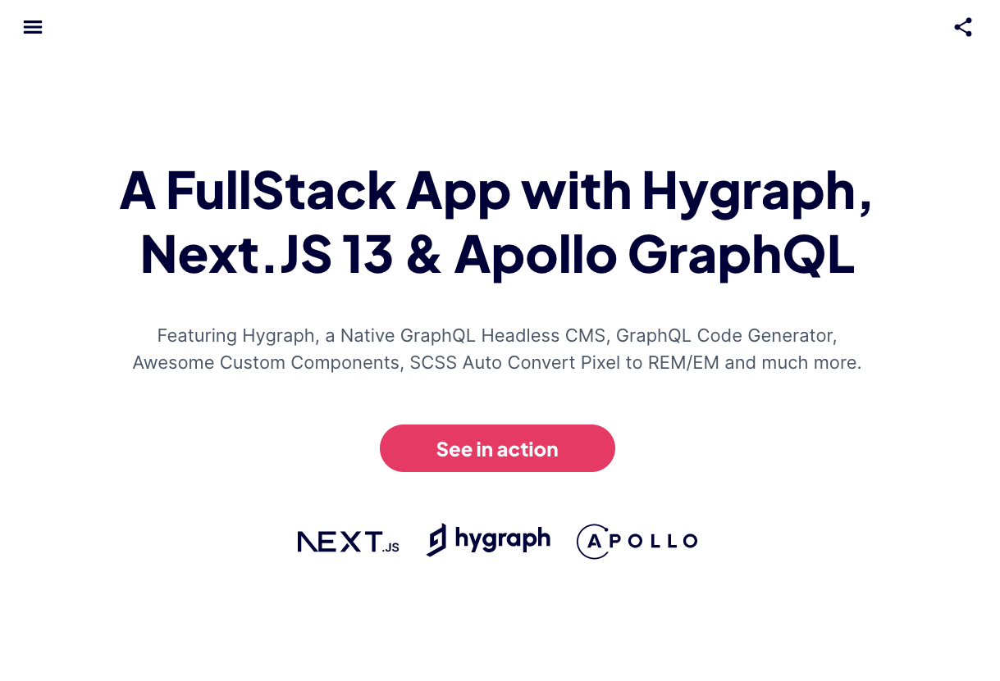

Open <https://alexfull.com> to see in action.

## Getting Started

First, run the development server:

```bash
npm run dev
# or
yarn dev
# or
pnpm dev
```

Open [http://localhost:3000](http://localhost:3000) with your browser to see the result.

## Learn More

Take a look at the following resources:

- [Next.js Documentation](https://nextjs.org/docs).
- [Hygraph Documentation](https://hygraph.com/docs).
- [Apollo Documentation](https://www.apollographql.com/docs/).
- [GraphQL Code Generator Documentation](https://the-guild.dev/graphql/codegen/docs/getting-started).
